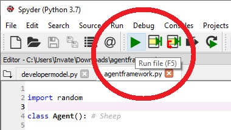
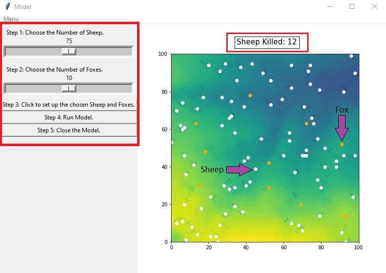

# GEOG5990 Assessment 1
Programming for Geographical Information Analysts: Core Skills

Student ID: 201376715

Website: [gy19cp.github.io](https://gy19cp.github.io/index.html)

## Model Summary

This animated agent-based model uses Spyder (Anaconda 3). The model code interacts with an agent framework code and an environment to produce coordinates on a 'raster' grid. The coordinates for the 'Sheep' variables are produced randomly and the 'Foxes' are plotted from an online web-derived set of data points. Both the ‘Foxes’ and ‘Sheep’ variables are defined as ‘Agents’ at distinctly defined separate times within the model. The 'Sheep' in the model- move, 'eat' the environment, share food with their nearest neighbour and a selection of the 'Sheep' are unfortunately subsequently 'killed' by the 'Foxes' when the 'Foxes' get sufficiently close. The code uses core Python language with an object-oriented approach, continuous integration and web-scraping.

### Model Files List
-	[User Model](https://gy19cp.github.io/usermodel.py) - Basic comments.
-	[Developer Model*](https://gy19cp.github.io/developermodel.py) - Recommended Model to download and run as it contains detailed explanatory comments, testing and debugging. 
-	[Agent Framework*](https://gy19cp.github.io/agentframework.py) - Code for Agents in the Model.
-	[in.txt*](https://gy19cp.github.io/in.txt) - Text file that contains the values for the Environment. 
- [License](https://github.com/gy19cp/GEOG5990Assessment1/blob/master/LICENSE) - License agreement for the Repository code.
- [Pycache](https://github.com/gy19cp/GEOG5990Assessment1/tree/master/__pycache__) - Folder directory automatically generated by Python containing bytecode cache files. 

The * indicates files are essential to download to run the model. 
These files download once selected. The in.txt file opens in the same tab so it is advised to open in a new tab or save the in.txt file, before selecting the back command to return to this page.

## Model Instructions 

**Step 1 -** Open Spyder (Anaconda 3). If you have not got this downloaded, it can be installed through the Anaconda Distribution [here](https://www.anaconda.com/distribution/). All code works with Python 3.7. Ensure when going through the installation process that you download ‘Spyder’. 

**Step 2 -** Download the necessary files by clicking on the following hyperlinks - [User Model](http://gy19cp.github.io/usermodel.py), [Developer Model](http://gy19cp.github.io/developermodel.py), [Agent Framework](http://gy19cp.github.io/agentframework.py) and [in.txt](https://gy19cp.github.io/in.txt). All these files should be downloaded to the computers ‘Downloads’ folder. The User Model contains basic comments for ease for the user. The Developer Model version contains explanatory comments, testing, and debugging. 

**Alternative Step 2 -** Complete the original Step 2 or this, not both. Alternatively you can select this [Repository](https://github.com/gy19cp/GEOG5990Assessment1) hyperlink, which will take you directly to the Assessment 1 Repository within the GitHub website. Once in the Repository, select the green ‘Clone or download’ button (on the right side) and ‘Download Zip’. The files downloaded to the ‘Downloads’ folder this way will need to be ‘extracted’ before they appear as individual files as shown below.  

**Step 3 -** Once downloaded, open Spyder and open the Agent Framework file and the selected Model (either the User/Developer version). 

**Step 4 -** Have the ‘agentframework’ file selected within Spyder and click the green right-pointed arrow to ‘Run’ it.

  
**Step 5 -** Now select the ‘model’ file within Spyder and click ‘Run’ again. This time a box entitled ‘Model’ should pop out. Click the subheading ‘Menu’ and ‘Run Model’. 
 

 
When the model is run, the orange dots represent ‘Foxes’ and the white dots represent ‘Sheep’. When a Sheep is killed by a Fox, the coordinates of where it took place is printed in the IPython Console. Where grass has been eaten, dark squares/pixels are shown. The darker the square/pixels, the more the grass has been grazed by multiple Sheep. This model will run until the Agent Food Store Capacity is met or until a specific number of steps (‘num_of_iterations’) has been completed. 

More details on the **GNU General Public License v3.0** associated with this model can be found [here](https://github.com/gy19cp/gy19cp.github.io/blob/master/LICENSE).
