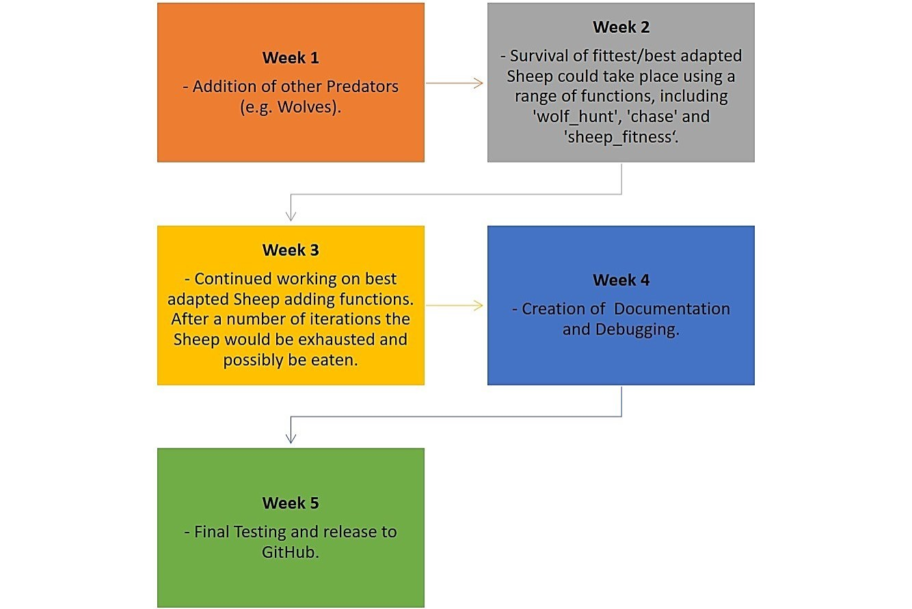

# GEOG5990 Assessment 1 
Programming for Geographical Information Analysts: Core Skills

Student ID: 201376715

Website: [gy19cp.github.io](https://gy19cp.github.io/index.html)

A concise, briefer Model Summary can be found by selecting the [Model 1](https://gy19cp.github.io/model1summary.html) webpage on the website.

This animated agent-based model uses Sheep and Foxes within an raster grid environment. Sheep move, eat, share food with neighbouring Sheep and are unfortunately killed by Foxes. Foxes move and eat Sheep up to a specific food capacity. 

### Model Files/Directories List
-	[Model*](https://gy19cp.github.io/model.py) - Model to download and run as it contains detailed explanatory comments, testing and debugging. 
-	[Agent Framework*](https://gy19cp.github.io/agentframework.py) - Code for Agents in the Model.
-	[in.txt*](https://gy19cp.github.io/in.txt) - Text file that contains the values for the Environment. 
- [License](https://github.com/gy19cp/GEOG5990Assessment1/blob/master/LICENSE) - GNU General Public License v3.0 agreement for the Repository code.
- [Pycache](https://github.com/gy19cp/GEOG5990Assessment1/tree/master/__pycache__) - Folder directory automatically generated by Python containing bytecode cache files. 

The __*__ indicates files are essential to download to run the model. 
These files download once selected. The in.txt file opens in the same tab so it is advised to open in a new tab or save the in.txt file, before selecting the back command to return to this page.

## Model Instructions 

**Step 1 -** Open Spyder (Anaconda 3). If you have not got this downloaded, it can be installed through the Anaconda Distribution [here](https://www.anaconda.com/distribution/). All code works with Python 3.7. Ensure when going through the installation process that you download ‘Spyder’. 

**Step 2 -** Download the necessary files by clicking on the following hyperlinks - [Model](http://gy19cp.github.io/model.py), [Agent Framework](http://gy19cp.github.io/agentframework.py) and [in.txt](https://gy19cp.github.io/in.txt). All these files should be downloaded to the computers ‘Downloads’ folder. 

**Alternative Step 2 -** Complete Step 2 above or this step, not both. Alternatively you can select this [Repository](https://github.com/gy19cp/GEOG5990Assessment1) hyperlink, which will take you directly to the Assessment 1 Repository within the GitHub website. Once in the Repository, select the green ‘Clone or download’ button (on the right side) and ‘Download Zip’. The files downloaded to the ‘Downloads’ folder this way will need to be ‘extracted’ before they appear as individual files as shown below. Both Step 2 methods are effective and up to personal preference.  

**Step 3 -** Once downloaded, open Spyder and within it the Agent Framework and Model files.

**Step 4 -** Have the ‘agentframework’ file selected within Spyder and click the green right-pointed arrow to ‘Run’ it.

  
**Step 5 -** Now select the ‘model’ file within Spyder and click ‘Run’ once more. When the Model pops out it contains a Graphical User Interface with 5 clearly marked 'Steps' to carry out. This involves choosing the Number of Sheep and Foxes, setting up the area for those animals, running the model and a choice to close the model early if needed. A text box with number of Sheep Killed is also present.  

If any problems occur with the Graphical User Interface, a 'Menu' above allows the Model to 'run' and 'close'. 
 

 
## Model Expectations 
The number of orange dots represent ‘Foxes’ and the white dots represent ‘Sheep’. When Step 3 button within the Graphical User Interface of the Model is clicked, the number of Sheep and Foxes chosen from the slider is printed in the iPython Console. Then the model is run, Sheep are killed by Foxes and the number in the 'Sheep Killed' text box within the Model increases. 

Where grass has been eaten by the Sheep, dark squares/pixels are shown. The darker the square/pixels, the more the grass has been grazed by multiple Sheep. This model will run until it is manually closed (Step 5), the Foxes Food Store Capacity is met or until a specific number of steps (‘num_of_iterations’) has been completed. The later two reasons for model closure are printed in the iPython Console when these occur. Once the Model ends naturally, it can be rerun instantly and different numbers of Sheep/Foxes can be selected for the new running of the Model. The 'Sheep Killed' text box starts again from zero. Ensure all Steps 1 to 5 within the Model are completed again to run the Model. 

Average Model Running Time is 40.45 seconds with on average 46 sheep killed when the recommended number of 75 Sheep and 10 Foxes are chosen. Timing may vary slightly with the number of agents chosen within the Model. 

## Potential Known Issues
- A strong internet connection is required as the web scraped html file for the Foxes movement will not work without an internet connection. The HTTPConnectionPool error will show if the internet is not connected.
- It is recommended to open the Model on a Windows Operating System. However, when doing so a pop up box entitled 'Figure' will appear alongside the 'Model' box. This is a preknown issue that occurs with Windows. This Figure box is not used. To close the Model fully before potentially rerunning the Model again, both the Model and the Figure box need to be closed and the red square in the IPython console selected (if it is not already greyed out).
- The errors 'NotImplementedError: Iteration over this class is unlikely to be threadsafe' and 'IndexError: list index out of range' have occurred before running the model. Numerous attempts have been made to rectify these, it does not appear to impact the model and if either of these show simply select the green 'run' arrow button again and the error should be replaced with a working file. The Model has in all tests ran without error after that.

## Testing Completed
- Throughout the Agent Framework and Model, certain text is printed or 'returned' to show a certain action has occurred. For instance, 'Foxes Food Store Capacity is met' is printed. 
- Also 'if' and 'else' statements are used to cover if one outcome does not occur then another outcome will happen instead. For instance, the Sheep movement is random. If the number generated is > 0.5, both the xy coordinates increase by 1 and the Sheep moves North or East. If the number generated is < 0.5, both xy coordinates decrease by 1 and the Sheep moves  South or West.

## Future Developments Roadmap 2020

## Final Points
I do not condon any form of animal cruelty. This model was only to represent skills developed following the [Programming for Geographical Information Analysts: Core Skills module](https://www.geog.leeds.ac.uk/courses/computing/study/core-python/) as part of an MSc GIS from the University of Leeds. 
