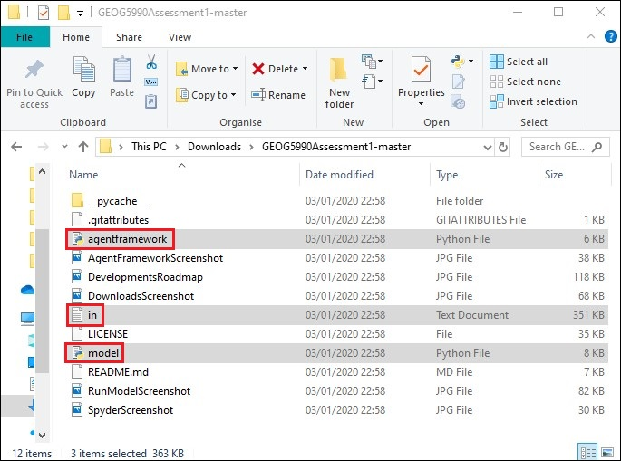

# GEOG5990 Assessment 1 
Programming for Geographical Information Analysts: Core Skills

Student ID: 201376715

Website: [gy19cp.github.io](https://gy19cp.github.io/index.html)

A concise, briefer Model Summary can be found by selecting the [Model 1](https://gy19cp.github.io/model1summary.html) webpage on the website.

This animated agent-based model uses Sheep and Foxes within a raster grid environment. Sheep move, eat, share food with neighbouring Sheep and are killed by Foxes. Foxes move and eat Sheep up to a specific food capacity. 

### Model Files/Directories List
-	[Model*](https://github.com/gy19cp/GEOG5990Assessment1/blob/master/model.py) - Model to download and run. It contains detailed explanatory comments, testing and debugging. 
-	[Agent Framework*](https://github.com/gy19cp/GEOG5990Assessment1/blob/master/agentframework.py) - Code for Agents in the Model.
-	[in.txt*](https://github.com/gy19cp/GEOG5990Assessment1/blob/master/in.txt) - Text file that contains the values for the Environment. 
- [License](https://github.com/gy19cp/GEOG5990Assessment1/blob/master/LICENSE) - GNU General Public License v3.0 agreement for the Repository code.
- [Pycache](https://github.com/gy19cp/GEOG5990Assessment1/tree/master/__pycache__) - Folder directory automatically generated by Python containing bytecode cache files. 

The __*__ indicates that it is essential to download these files in order to run the model. Selecting hyperlinks in the Model Files will show the full code within Github. 

## Model Instructions 

**Step 1 -** Open Spyder (Anaconda 3). If you have not got this downloaded, it can be installed through the Anaconda Distribution [here](https://www.anaconda.com/distribution/). All code works with Python 3.7. Ensure when going through the installation process that you download ‘Spyder’. 

**Step 2 -** Download the necessary files by clicking on 'Clone' in the top right hand corner of the [Assessment 1](https://github.com/gy19cp/GEOG5990Assessment1) Repository within the GitHub website. Once in the Repository, select the green ‘Clone or Download’ button (on the right hand side) and ‘Download Zip’. Files downloaded to the ‘Downloads’ folder this way will need to be ‘extracted’ before appearing as individual files as shown below. To extract files, right click on the zipped folder and select 'extract all', making sure to choose a suitable location for the files. 

 

**Step 3 -** Once downloaded, open Spyder and within it the Agent Framework file and Model file.

**Step 4 -** Have the 'agentframework.py' file selected within Spyder and click the green right-pointed arrow to ‘Run’ it.

  
**Step 5 -** Now select the 'model.py' file within Spyder and click ‘Run’ once more. When the Model pops out it contains a Graphical User Interface with 5 clearly marked Steps A to E. This involves choosing the number of Sheep and Foxes, setting up the area for the chosen number of animals, running the model and a choice to close the model early if needed. A text box with number of Sheep Killed is also present.  

If any problems occur with the Graphical User Interface, a dropdown 'Menu' above the sliders allows the Model to 'Run' and 'Close'. 
 

 
## Model Expectations 
The number of orange dots represent ‘Foxes’ and the white dots represent ‘Sheep’. When Step C button within the Graphical User Interface of the Model is clicked, the number of Sheep and Foxes chosen from the slider is printed in the iPython Console. Then the model is run, Sheep are killed by Foxes and the number in the 'Sheep Killed' text box within the Model increases. 

Where grass has been eaten by the Sheep, dark squares/pixels are shown. The darker the square/pixels, the more the grass has been grazed by multiple Sheep. This model will run until it is manually closed (Step E), the Foxes Food Store Capacity is met or until a specific Number of Steps (‘num_of_iterations’) has been completed. The latter two reasons for model closure are printed in the iPython Console when these occur. Once the Model ends naturally, it can be rerun instantly and different numbers of Sheep/Foxes can be selected for the new running of the Model. The 'Sheep Killed' text box starts again from zero. Ensure all Steps A to E within the Model are completed again to run the Model. 

Average Model Running Time is 40.45 seconds with on average 46 sheep killed when the recommended number of 75 Sheep and 10 Foxes are chosen. Timing will vary with the number of agents chosen within the Model. 

## Potential Known Issues
- A strong internet connection is required as the web scraped html file for the Foxes movement will not work without an internet connection. The HTTPConnectionPool error will show if the internet is not connected.
- It is recommended to open the Model on a Windows Operating System. However, when doing so a pop up box entitled 'Figure' will appear alongside the 'Model' box. This is a preknown issue that occurs with Windows. This Figure box is not used. To close the Model fully before restarting and rerunning the Model, both the Model and the Figure box need to be closed and the red square in the IPython console selected (if it is not already greyed out).
- After multiple tests and code editing, the current model does not appear to have errors. Previously, the errors 'NotImplementedError: Iteration over this class is unlikely to be threadsafe' and 'IndexError: list index out of range' have occurred before running the model. However when these appeared, they have not noticeably impacted the model. If either of these show, select the green 'run' arrow button again. The error should be replaced with a working file and the model should run successfully. 

## Testing Completed
- Throughout the Agent Framework and Model, specific text is printed or 'returned' to show a certain action has occurred. For instance, 'Foxes Food Store Capacity is met' is printed. 
- Statements with 'if' and 'else' are used. If one outcome does not occur then another outcome will happen instead. For instance, the Sheep movement is random. If the number generated is > 0.5, both the xy coordinates increase by 1 and the Sheep moves North or East. If the number generated is < 0.5, both xy coordinates decrease by 1 and the Sheep move South or West.

## Future Developments Roadmap 2020

## Final Points
I do not condone any form of animal cruelty. This model was only to represent skills developed following the [Programming for Geographical Information Analysts: Core Skills module](https://www.geog.leeds.ac.uk/courses/computing/study/core-python/) as part of an MSc GIS from the University of Leeds. 
